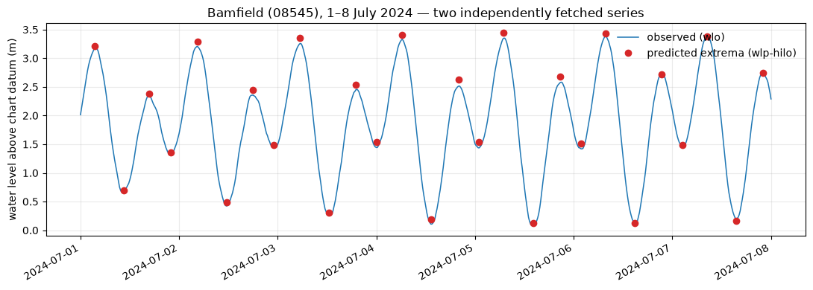
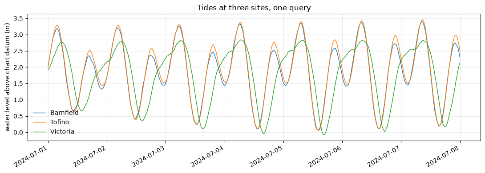

# omnisea

**A unified Python client for ocean, tidal, and weather data.**

Marine data access is fragmented across provider-specific APIs, each with its own field names,
units, time conventions and paging rules. omnisea is the middleware layer above them: pluggable
adapters per source, CF-standard canonicalization, EDR-shaped spatial-temporal queries, and
`xarray.DataTree` as the output container so 1-D point series and 4-D grids can coexist without a
lossy flat join.

```bash
pip install -e ".[dev]"
```

**Want to see what it's like to use?** → **[examples/bamfield.ipynb](examples/bamfield.ipynb)**
is a complete walkthrough with output and plots already rendered, or run
[examples/bamfield.py](examples/bamfield.py) for the same thing in your terminal.

## The worked example

Bamfield Marine Sciences Centre sits on Barkley Sound, Vancouver Island. Ask what data exists
within 30 km of it:

```python
import omnisea

cat = omnisea.discover(lat=48.8353, lon=-125.1358, radius_km=30,
                       time=("2024-07-01", "2024-07-08"))
print(cat)
```

```
            source station_id                         name  distance_km  n_rows_est
         dfo_tides      08545                     Bamfield     0.079201         700
eccc_climate_daily    1031316             CAPE BEALE LIGHT     8.031310           7
eccc_climate_daily    1035940                PACHENA POINT    12.827256           7
  eccc_hydrometric    08HB048 CARNATION CREEK AT THE MOUTH    13.473495         672
  eccc_hydrometric    08HB014   SARITA RIVER NEAR BAMFIELD    13.731407         672
         dfo_tides      08585                Effingham Bay    13.806121          28
```

The DFO tide gauge is 80 m from the research station. Now pull the nearest station per source:

```python
tree = cat.filter(nearest=1).fetch()
print(omnisea.summary(tree))
```

```
                          node     station_name  n_time  variables
          /in_situ/tides/08545         Bamfield     672  water_surface_height_above_reference_datum, reviewed
 /predictions/tides_hilo/08545         Bamfield      27  water_surface_height_above_reference_datum_at_extremum, reviewed
/in_situ/weather_daily/1031316 CAPE BEALE LIGHT       8  air_temperature, air_temperature_min, air_temperature_max, ...
```

Two things arrived from that: what the gauge *measured*, and what the harmonic model
*predicts*. Plotted together, the predicted extrema land on the observed peaks:



That agreement is the real end-to-end check — it means the times, the units and the datum are
all right, not merely parseable. The network test suite asserts it.

Then save it, losslessly, as netCDF groups:

```python
tree.to_netcdf("bamfield.nc")
import xarray as xr
xr.open_datatree("bamfield.nc")     # the group structure round-trips
```

**Discovery is a separate step on purpose.** A marine query can quietly become enormous — ECCC's
`climate-hourly` collection reports 276 *million* rows unfiltered — so `discover()` returns a
printable estimate and `fetch()` refuses anything over a row ceiling, with the knob to change it
in the error message. Nothing large happens by accident.

## Many locations at once

A **`Site`** is the location type: coordinates, its own search radius, and the name you know it
by. That name travels with the results, so what comes back is joinable to your own records
without a second lookup.

`(lat, lon, name)` tuples, dicts, and DataFrames with `lat`/`lon` columns are accepted too — so
a CSV of moorings you already keep works without reshaping it first. Locations with no nearby
data simply contribute nothing, which is normal, not an error:

```python
from omnisea import Site

sites = [
    Site(48.8353, -125.1358, "Bamfield",   radius_km=25),
    Site(48.4204, -123.3656, "Victoria",   radius_km=25),
    Site(48.0000, -128.0000, "Open ocean", radius_km=25),   # nothing here
]

tree = omnisea.positions(sites, time=("2024-07-01", "2024-07-08"), nearest=1)

omnisea.coverage(tree)      # one row per requested site, INCLUDING the empty ones
omnisea.to_dataframe(tree)  # tidy: time, site, station_id, variable, value
```

`coverage()` reports every site you asked for, so gaps are visible rather than inferred from an
absence. Pass `group_by_site=True` to nest nodes as `/Bamfield/in_situ/tides/08545`.



Bamfield and Tofino track each other closely — both open Pacific coast — while Victoria, inside
the Strait of Juan de Fuca, shows a markedly stronger diurnal inequality. One call, three
stations, three agencies' worth of plumbing you did not have to write.

## Bring your own data and build a model

The tree is lossless but ragged — tides every 15 minutes, climate summaries once a day, tidal
extrema at irregular turning points. A model wants a rectangle. `align()` produces one.

Say you have a field sheet: irregular sampling times and your own measurement. Join the
environmental data onto *your* timestamps:

```python
mine = pd.read_csv("field_samples.csv")     # time, chlorophyll_ug_L, secchi_m

tree = omnisea.fetch(sites=BAMFIELD, time=("2024-07-01", "2024-07-08"), nearest=1)
X = omnisea.align(tree, on=mine, tolerance="30min")
```

```
                     chlorophyll_ug_L  water_surface_height...  air_temperature  precipitation_amount
2024-07-01 09:14:00              5.64                    0.852             14.0                   0.0
2024-07-01 15:40:00              3.25                    2.212             14.0                   0.0
2024-07-02 10:05:00              1.77                    0.742             14.0                   0.0
2024-07-03 08:50:00              1.61                    1.864             13.8                   0.0
```

Your columns come through, so you have `y` and `X` in one table — straight into scikit-learn or
statsmodels. Or resample everything onto a regular grid instead:

```python
hourly = omnisea.align(tree, freq="1h")
weekly = omnisea.align(tree, freq="7D")
```

### Why this isn't just `.resample()`

Resampling a series wrongly is one of the easiest ways to publish a wrong result, and the right
answer differs per variable. omnisea doesn't guess — CF `cell_methods`, which every provider
already publishes, says what each variable *is*:

| `cell_methods` | Downsampling | Upsampling |
|---|---|---|
| `time: sum` (precipitation) | **sum** — a weekly total is the sum of daily totals | forward-fill; interpolating invents an intra-day distribution that was never measured |
| `time: maximum` (gust speed) | **max** — the max of maxima is a real maximum; their mean is a statistic of nothing | forward-fill |
| `time: mean` (daily mean temp) | mean | forward-fill — a daily mean spread across its own day is honest |
| none / `time: point` (tide height) | mean | **interpolate** — the only case where it's safe |

The same metadata governs the `on=` join. An **interval summary** matches *backwards within its
own interval* — a sample at 10:05 gets the total for the day containing it. An **instantaneous
reading** matches to the nearest observation within `tolerance`. Without that distinction, a
30-minute tolerance against a value stamped at midnight silently returns a column of `NaN`.

Every column records how it got there:

```python
X.attrs["omnisea_aggregation"]
```
```
water_surface_height_above_reference_datum@08545   nearest within 30min (8/8 matched)
air_temperature@1031316                            backward within its own 1d interval (8/8 matched)
precipitation_amount@1031316                       backward within its own 1d interval (8/8 matched)
water_surface_height..._at_extremum@08545          nearest within 30min (0/8 matched)
```

That last line is the point: what *couldn't* be matched is reported, not silently `NaN`.

### Putting your data in the tree

If your measurements are the thing being modelled and you want one object holding response and
predictors together — round-trippable to netCDF, with your provenance beside the providers':

```python
tree = omnisea.add_local(tree, mine, name="Chlorophyll grab samples",
                         lat=48.8353, lon=-125.1358, station_id="BAM-CHL",
                         var_attrs={"chlorophyll_ug_L": {"units": "ug L-1"}})
```

A `cell_methods` you supply in `var_attrs` is honoured by `align()` exactly as a provider's
would be.

## What you get back

A plain `xarray.DataTree` — not a subclass, so it interoperates with the whole ecosystem.
Conveniences are module functions: `omnisea.summary(tree)`, `omnisea.to_dataframe(tree)`,
`omnisea.stations(tree)`, `omnisea.coverage(tree)`.

Each node is a CF discrete-sampling-geometry `timeSeries`: a `time` dimension, scalar
`latitude`/`longitude`/`station_id`/`station_name` coordinates, and attributes recording
`featureType`, `Conventions`, provider, licence, source URL and datum. The root records the query.

Observations and predictions live in **separate branches** (`/in_situ/tides/` vs
`/predictions/tides_hilo/`), because a harmonic tide prediction and a measurement look identical
in a flat table and are not remotely the same thing.

## Two promises about your numbers

**Nothing is silently rescaled.** Values stay in the units the provider published, and the
`units` attribute says which those are. Ask for canonical CF units explicitly:

```python
tree = omnisea.fetch(..., to_cf_units=True)   # degC -> K, km/h -> m/s, kPa -> Pa
```

Encoding *repairs* are different and always applied — ECCC ships wind direction in tens of
degrees, so a raw `25` means 250°. That is a storage encoding, not a unit choice.

**Nothing is silently dropped.** Fields with a CF equivalent are renamed and described; fields
without one travel under the provider's own name, tagged `omnisea_mapped = 0`. A SWOB station
returns `air_temperature` *and* `batry_volt`. QC flags are carried as `<var>_qc`, never discarded.

```python
omnisea.variables()   # the CF names available, and which source serves each
```

## Sources

| Source | Provider | Data |
|---|---|---|
| `dfo_tides` | `dfo` | Water levels: observed, predicted, and high/low events (1573 stations) |
| `eccc_climate` | `eccc` | Hourly surface climate observations |
| `eccc_climate_daily` | `eccc` | Daily climate summaries |
| `eccc_swob` | `eccc` | Surface weather observations, realtime (~30 days) |
| `eccc_hydrometric` | `eccc` | Realtime water level and river discharge |
| `cioos_metadata` | `cioos` | CIOOS metadata records — discovery only, contributes catalogue rows |

Select a single dataset or a whole organization:

```python
omnisea.fetch(..., providers="dfo_tides")   # one dataset
omnisea.fetch(..., providers="eccc")        # all four ECCC datasets
```

### CIOOS metadata records

`cioos_metadata` reads records authored in the
[CIOOS metadata-entry-form](https://github.com/cioos-siooc/metadata-entry-form). It is a
*discovery* source: a record says a dataset exists, where and when, which Essential Ocean
Variables it covers, and where to download it — it hands back a URL, not an array.

There is no single public endpoint (the form publishes each organization's records to that
organization's own GitHub repo, and its Firebase database is not world-readable), so point it at
wherever you keep them:

```python
cat = omnisea.discover(bbox=(-125.3, 48.7, -125.0, 49.0), time=("2024-01-01", "2024-12-31"),
                       cioos_records="cioos-siooc/records")   # or a path, directory, or URL
cat.metadata()    # titles, extents, EOVs, licences, download URLs
```

GOOS EOV tags are translated to CF standard names, so `variables=["sea_surface_temperature"]`
matches a record tagged `seaSurfaceTemperature`.

## Adding your own source

A new data source is **one new file**, not a refactor. omnisea models two levels — a `Provider`
is an organization (licence, base URL, auth); a `DataSource` is one queryable dataset (fields,
node path, discover/fetch). Implement the interface and your source is discovered, filtered,
CF-described and assembled alongside every built-in one.

**→ [docs/adding-a-provider.md](docs/adding-a-provider.md)** is the full contract, with a
complete worked example in [examples/csv_stations.py](examples/csv_stations.py) that the test
suite exercises.

Ship it as a package and it is indexed automatically:

```toml
[project.entry-points."omnisea.providers"]
my_org = "my_package.provider:MyOrgProvider"
```

## Types

Two small types carry meaning that a bare tuple would lose:

```python
from omnisea import Site

site = Site(48.8353, -125.1358, "Bamfield Marine Sciences Centre", radius_km=30)
site.label                      # 'Bamfield Marine Sciences Centre' — travels onto the data
omnisea.fetch(sites=site, time=...)
```

`BBox` is a `NamedTuple` in the OGC order `(west, south, east, north)`, so `bbox.south` beats
`bbox[1]` and a reader can tell which convention is in play — lon-first, not the lat-first order
people often reach for. It still unpacks, indexes and compares as an ordinary tuple, so plain
tuples remain acceptable input everywhere:

```python
cat = omnisea.discover(bbox=(-125.22, 48.78, -125.05, 48.90), time=...)
cat.query.bbox.south      # 48.78
cat.query.bbox.centre     # (48.84, -125.135) as (lat, lon)
```

A lat-first bbox is rejected rather than silently swapped.

## Design notes

`Query` is deliberately EDR-shaped — `bbox` or sites with radii, a UTC-normalized interval, CF
variable names, optional depth — so a native OGC API - EDR adapter is close to a pass-through.
`DataSource.fetch()` may return either a `StationSeries` (point path) or a ready `xarray.Dataset`
(gridded path); that union is the seam that lets Copernicus or ERDDAP `griddap` drop in without
touching the point-series assembly.

A few upstream traps are handled, each verified against the live services:

- **IWLS window caps are resolution-dependent** — 7 days at `ONE_MINUTE`, 31 days at every
  coarser resolution. Requests chunk to whichever applies, with boundary rows de-duplicated.
- **`climate-stations` publishes `LATITUDE` as integer micro-degrees** (`483300000`), so
  coordinates always come from `geometry.coordinates`.
- **`climate-hourly` filters on `LOCAL_DATE` while publishing `UTC_DATE`**, so a UTC window
  comes back shifted by the station's offset. omnisea pads the request and trims to the window
  you actually asked for.
- **`climate-daily` has no `UTC_DATE` at all.** Daily aggregates keep their local calendar date,
  stamped at `00:00Z`, with the convention recorded in the node's `time_reference` attribute.
  Inventing a UTC instant for a daily statistic would imply precision the data lacks.
- **SWOB units are read from each field's `-uom` sibling**, never hardcoded.

`sea_surface_height_above_reference_datum` — the name that reads as the obvious one for tide
gauge data — **is not in the CF standard name table**. omnisea emits the real name,
`water_surface_height_above_reference_datum`, and accepts the other as an input alias. A network
test validates every emitted `standard_name` against the published table.

## Examples

| File | What it shows |
|---|---|
| [examples/bamfield.ipynb](examples/bamfield.ipynb) | The full walkthrough, executed, with plots |
| [examples/bamfield.py](examples/bamfield.py) | The same walkthrough as a terminal script |
| [examples/csv_stations.py](examples/csv_stations.py) | A complete third-party provider in ~100 lines |

## Tests

```bash
pytest -m "not network"   # 161 unit tests over committed real API responses
pytest -m network         # 21 live integration tests
```

The network suite covers the edge cases fixtures cannot: the IWLS interval caps and chunk
stitching, pygeoapi paging past one page, stations correctly excluded for no time overlap, the
netCDF round-trip, and CF vocabulary validation.

It also checks the *physics*, not just the parsing: the observed series must be semidiurnal
(~2 highs/day), water levels must be physically plausible, and the independently-fetched
predicted extrema must line up with the observed peaks — currently within a median of 18 minutes
and 0.044 m.

## Licence

MIT. Data licences belong to the providers and are recorded on every node.
